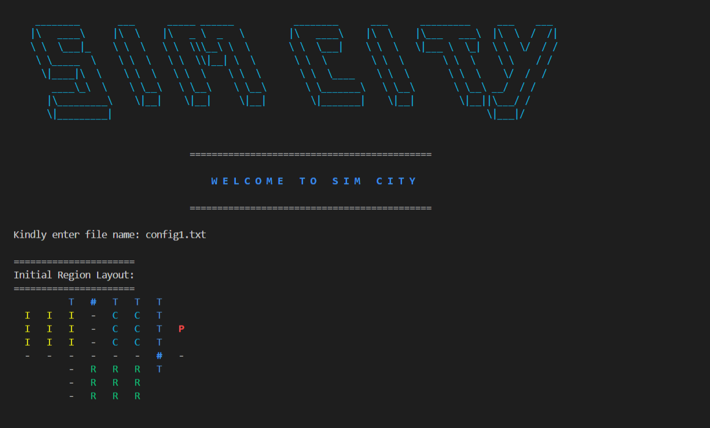

<div align="center"> 
  <h1>Sim City - A C/C++ City Growth Simulation</h1>
</div>

<br> 

## Introduction
This urban development simulation project simulates the growth of a city over time, focusing on
residential, commercial, and industrial zones, and how pollution
impacts development. The core processes include constructing these zones, managing resources such as workers and goods, and monitoring pollution levels. 

<br> 



<br> 

## Project Structure
- main.cpp             --> Contains the main() function
- config1.txt          --> Configuration file
- region1.csv          --> Region layout file
- config.cpp/h         --> Implement functions to read and parse configuration file values (region layout, time limit, refresh rate).

<br> 

## Compilation Instructions
**Using g++:**
```bash
g++ *.cpp -o simcity
```

<br> 

## Running the Program
**After compiling, run the executable:**
```bash
./simcity
```

You will be prompted for:
- The configuration file name.

Then the program will read the region layout file (CSV format)
and start simulating the city growth.

<br> 

## ⭐ Contributing 
Contributions are welcome! If you find any issues or improvements, feel free to open an issue or submit a pull request.

<br> 

## Contact / Acknowledgments
All code is written by Oluwatobi Emmanuel.
